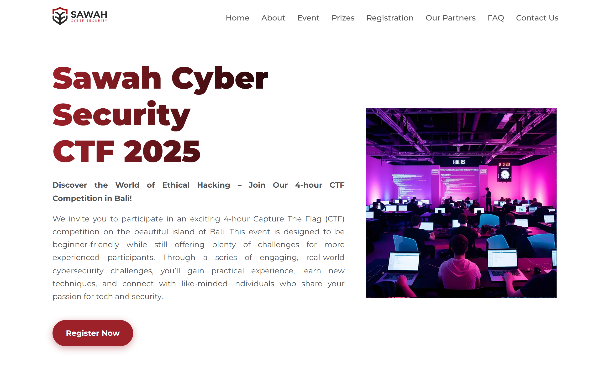

# Sawah Cyber Security CTF 2025 — Landing Page

The landing page for the Sawah Cyber Security CTF 2025, a 4-hour Capture The Flag competition held in Bali.



## About the event

The CTF brings together students, professionals, and cyber enthusiasts for a set of hands-on hacking challenges. It is designed to stay beginner friendly while still giving experienced players something to work on. Challenge categories cover Web Exploitation, Reverse Engineering, Binary Exploitation, OSINT, and AI.

## Page sections

- Hero with the event pitch and a registration call to action
- Live countdown to the moment the competition opens
- About, Categories, and Event Details
- Timeline and Prizes
- Community and Academic Partners with sponsor logos
- FAQ, sponsorship information, and contact details

## Built with

Plain HTML, CSS, and vanilla JavaScript. No framework and no build step, which keeps the whole site to a handful of files that can be dropped onto any static host.

## Running it locally

Clone the repository and open `index.html` in a browser. That is the entire setup.

To serve it over HTTP so relative paths behave exactly as they do in production:

```bash
python -m http.server 8000
```

Then visit `http://localhost:8000`.

## Deployment

The page was published at `ctf.sawahcyber.id`. That host is not currently responding, so the copy in this repository is the reliable way to view it.

## Related

A rebuilt version of this page using React and Vite lives in [ctf-landing-page-better](https://github.com/GianneAngely/ctf-landing-page-better).
